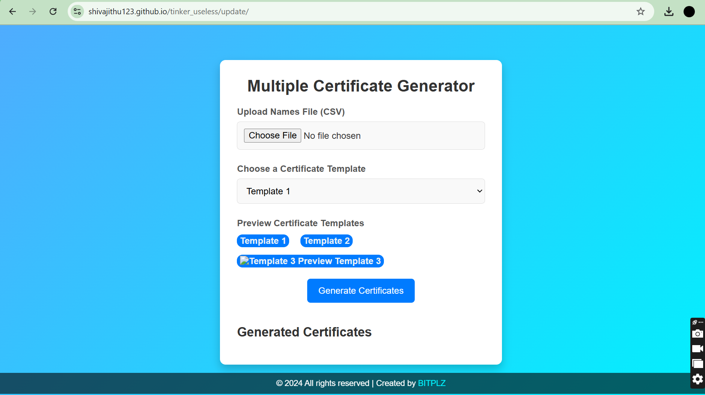
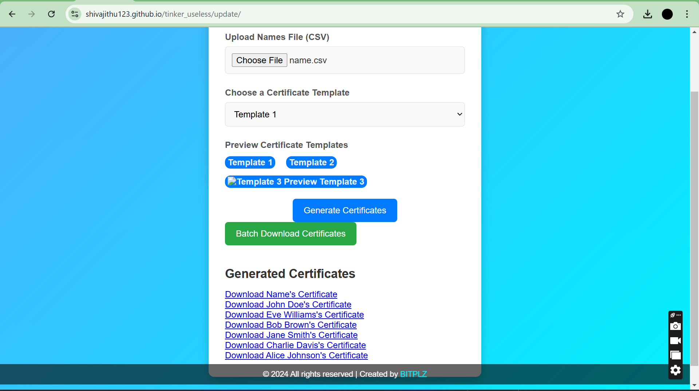

# [Multiple Automated Certificate Generator] 🎯
**[live link](https://shivajithu123.github.io/tinker_useless/update/)

## Basic Details
### Team Name: [BITSPLZ]

### Team Members
- Team Lead: [Shivadath A] - [Government Engineering College Idukki]
- Member 2: [Akhila K S] - [Government Engineering College Idukki]
- Member 3: [Alwin Shaji] - [Government Engineering College Idukki]

### Project Description
  This project automates the generation of multiple certificates by allowing users to select a template and input necessary details, streamlining the process of creating personalized certificates efficiently. The system dynamically populates and generates certificates based on chosen designs, making it ideal for events, courses, or recognitions that require bulk certificate issuance.
  
### The Problem (that doesn't exist)
[What ridiculous problem are you solving?]

The problem: People are wasting countless hours handcrafting certificates one by one! In a world where we can automate just about anything, why should anyone have to tediously fill out certificates individually? Our project solves the ‘pressing’ issue of manual certificate generation, freeing up precious time and eliminating the existential dread of repetitive typing for each name!

### The Solution (that nobody asked for)
[How are you solving it? Keep it fun!]

"We’re here to save humanity from the agony of repetitive certificate filling! With our auto-magical certificate generator, simply choose a snazzy template, enter a list of names, and poof—personalized certificates appear in seconds! No more monotonous mouse clicks or copy-pasting disasters. It’s the superhero you didn’t know you needed, fighting the injustice of unnecessary labor, one certificate at a time!"

## Technical Details
### Technologies/Components Used
For Software:
- [Languages used]
- [Frameworks used]
- [Libraries used]
- [Tools used]

For Hardware:
- [List main components]
- [List specifications]
- [List tools required]

### Implementation
For Software:
# Installation
[commands]

# Run
[commands]

### Project Documentation
For Software:

# Screenshots (Add at least 3)

*Add caption explaining what this shows*

*Add caption explaining what this shows*

*Add caption explaining what this shows*

# Diagrams

*Add caption explaining your workflow*

For Hardware:

# Schematic & Circuit

*Add caption explaining connections*

*Add caption explaining the schematic*

# Build Photos

*List out all components shown*

*Explain the build steps*

*Explain the final build*

### Project Demo
# Video
[Add your demo video link here]
*Explain what the video demonstrates*

# Additional Demos
[Add any extra demo materials/links]

## Team Contributions
- [Shivadath A]: [Batch downloading of generated certificates(ZIP file)]
- [Akhila K S]: [UI UX Design]
- [Alwin Shaji]: [Template generation and csv parsing]

